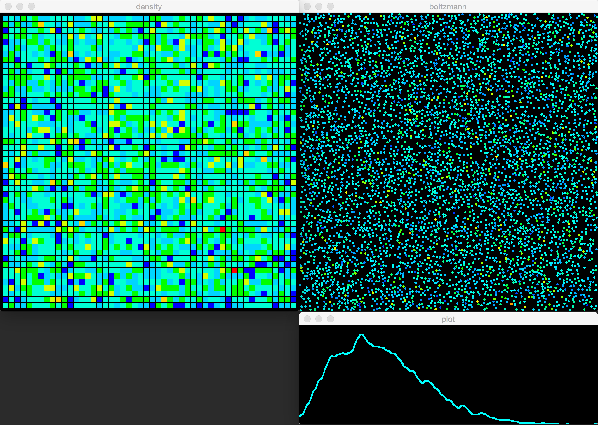

# boltzmann
Maxwell-Boltzmann distribution simulator written in Rust.

Plots the distribution of particle velocities, [Maxwell-Boltzmann distribution](https://en.wikipedia.org/wiki/Maxwell%E2%80%93Boltzmann_distribution) 

Spatial hashing or a Quadtree is used to decrease the number of potential collisions.
